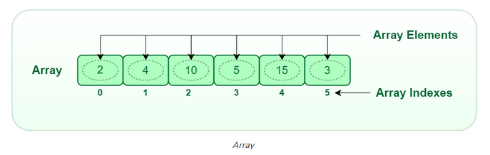

## Array - 

An array is a collection of items stored at contiguous memory locations. The idea is to store multiple items of the same type together. This makes it easier to calculate the position of each element by simply adding an offset to a base value, i.e., the memory location of the first element of the array (generally denoted by the name of the array).

## Basic terminologies of array

- Array Index: In an array, elements are identified by their indexes. Array index starts from 0.
- Array element: Elements are items stored in an array and can be accessed by their index.
- Array Length: The length of an array is determined by the number of elements it can contain. 



Array in JS 

```javascript
// JS code
let emptyAr = [];
let arr=[10,20,30]; // This array will store integer
let arr2 = ['c', 'd', 'e'] // This array will store characters
let arr3 = [28.5, 36.5, 40.2] // This array will store floating elements
```